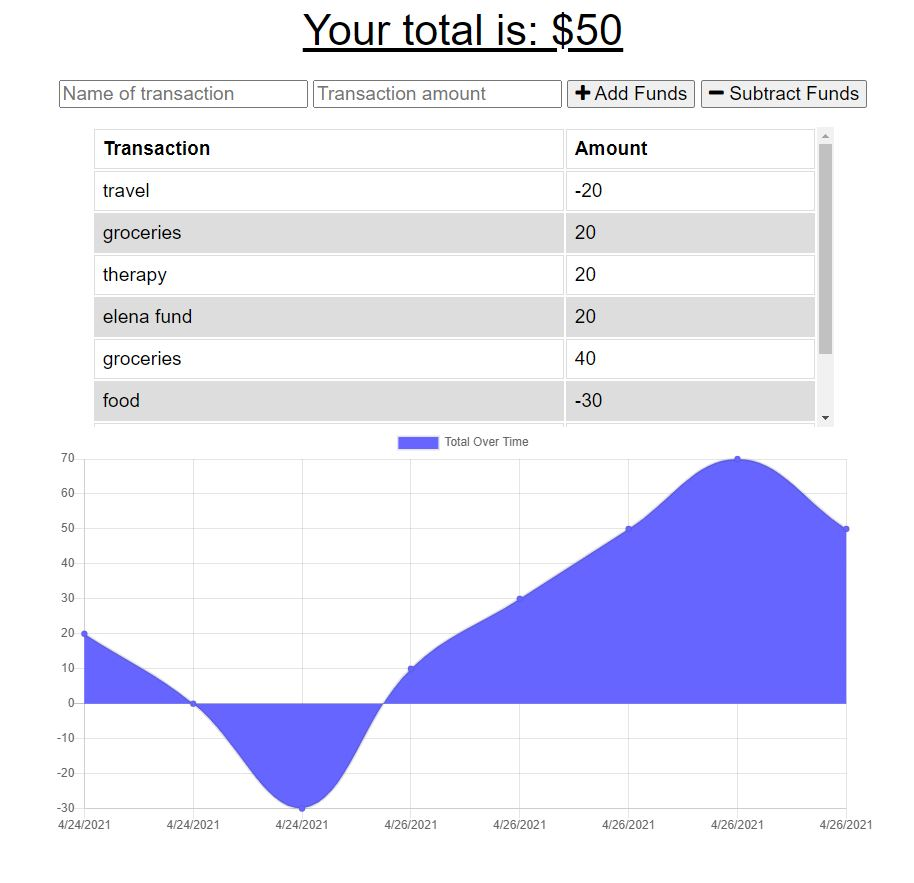

## Budget Tracker

This application utilizes several libraries to create a responsive budget tracker for users. The application was deployed to Heroku and incorporates backend and front-end web development. Users can enter deposits and expenses offline which will update their online tracker.

## Deployed Application

